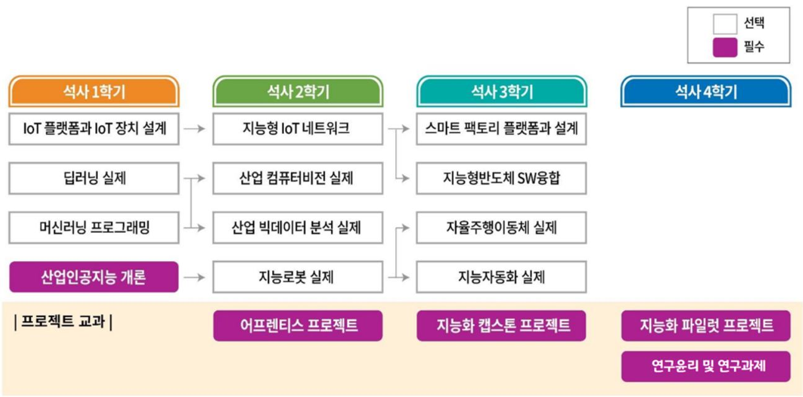

# **Industrial AI** 

## Introduction

4차 산업혁명을 주도할 창의적 문제해결 능력을 갖춘 인공지능 관련 전문가를 육성하는 것을 목표

## Educational Course

  

 

### 재학생 수행 프로젝트

- `2020-2학기` [어프렌티스 프로젝트](https://github.com/kjj3436/industrial-AI/tree/master/projects/2020-2학기_어프렌티스%20프로젝트): 문제해결방법론 교육 및 프로젝트 준비
- `2020-2학기` [지능로봇 실제](https://github.com/kjj3436/industrial-AI/tree/master/projects/2020-2학기_지능%20로봇%20실제): 로봇 운영체제 ROS를 중심으로 지능형 로봇 설계 및 운영 실습
- `2021-1학기` [딥러닝실제](https://github.com/kjj3436/industrial-AI/tree/master/projects/2021-1학기_딥러닝%20실제): 인공지능시스템의 기본이 되는 신경회로망 및 딥러닝에 대해서 배움
- `2021-1학기` [산업인공지능개론](https://github.com/kjj3436/industrial-AI/tree/master/projects/2021-1학기_산업인공지능%20개론): 산업 현장 적용을 위한 인공지능 기술의 주요 개념 및 알고리즘을 학습
- `2021-2학기` [산업 컴퓨터비전실제](https://github.com/kjj3436/industrial-AI/tree/master/projects/2021-2학기_산업%20컴퓨터비전%20실제): 실제 산업현장에서 사용이 가능한 컴퓨터 비전 기술에 대해서 배움
- `2021-2학기` [지능화 파일럿](https://github.com/kjj3436/industrial-AI/tree/master/projects/2021-2학기_지능화%20파일럿%20프로젝트): 자율적으로 주제를 정하여,독자적으로 설계 및 제작하고 최종적으로 결과물 발표
- `2022-1학기` [지능화 캡스톤 프로젝트](https://github.com/kjj3436/industrial-AI/tree/master/projects/2022-1학기_지능화%20캡스톤%20프로젝트): 지능화 교과목을 통해 배운 인공지능 지식을 활용하여 재직 기업 및 실생활에 필요한 프로젝트를 수행
- `2022-1학기` [연구윤리 및 연구과제1](https://github.com/kjj3436/industrial-AI/tree/master/projects/2022-1학기_연구윤리%20및%20연구과제1): 학위논문 작성을 위하여 연구 주제를 설정하고, 연구 과정을 계획하며, 연구 결과를 도출하기 위한 실험실습을 수행
### GitHub 교육

- `2020-10` [GitHub이용및포트폴리오작성자료](https://github.com/Bessesian/industrial-AI/tree/master/Education): 포트폴리오 관리 자료

