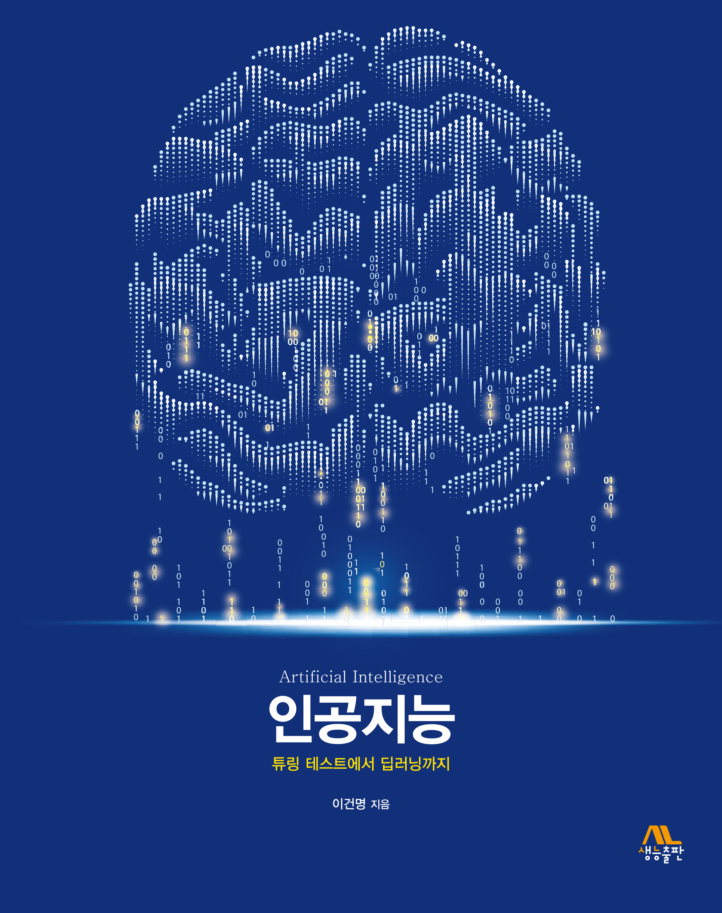

# **산업인공지능 개론** 

## Introduction

강의 개요
- 산업 현장 적용을 위한 인공지능 기술의 주요 개념 및 알고리즘을 학습하고, 파이썬 기반의 오픈소스 SW를 활용한
  실습을 수행하는 실무역량 강화를 위한 교과목이다.

강의 목표
- 인공지능의 접근방법과 핵심 개념에 대해서 이해한다.
- 최신 인공지능 기술은 산업현장에 적용 가능성을 검토하고 설명할 수 있다.
- 인공지능 기술 적용을 위한 오픈 소스를 활용한 실습을 통해 적용 능력을 배양한다.

문제해결방법
- Python 기반의 오픈소스를 활용한 실습을 한다.
- 인공지능 기술을 적용할 수 있는 실제 현장 문제를 발굴하고, 개발 전략을 수립한다
- 수강 중에 3가지 프로젝트를 수행하고 결과물을 GitHub에 공개한다.
-     프로젝트 1. 재직 현장의 문제에 대한 간단한 전문가시스템을 개발한다.
-     프로젝트 2. 재직 현장에서 발생하는 데이터에 대해 기계학습 기법을 적용하는 시스템을 개발한다.
-     프로젝트 3. 재직 현장에서 발생하는 이미지 데이터에 대한 인식 시스템을 개발한다. 

