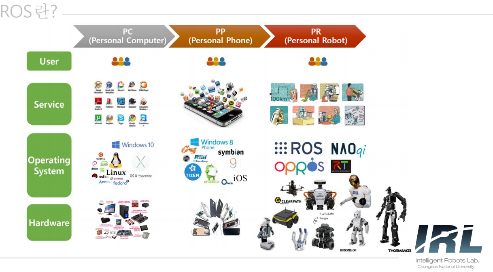

# **Intelligent Robots Practice** 

## Introduction

Robot Operation System(ROS)
- Robot software를 개발하기 위한 framework
- ROS wiki에서는 Meta-operation system이라고 명명.
- Node 단위의 분산 프레임워크로 구성되어 코드의 재사용 및 협업 용이(모듈화)
- Node간 message 형식만 맞으면 다양한 언어사용 가능
- 현재 Melodic Release 및 ROS 2개발이 진행되고 있지만, 실습에서는 ROS kinetic사용

## ROS란?
  

