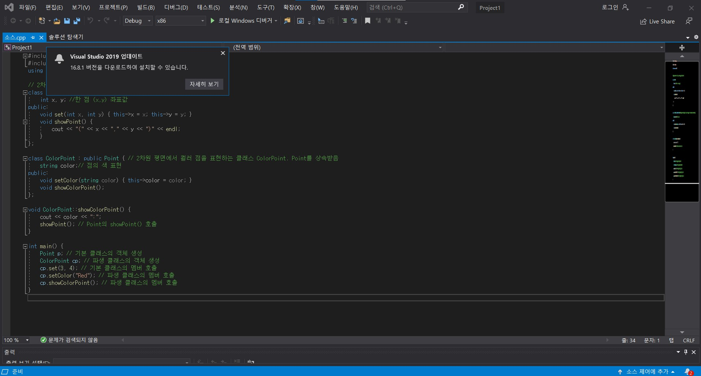

# **C/C++ Programming**

## Introduction

C++은 C를 Simula의 특성을 통해 확장한 결과물입니다. 
C의 장점으로는 범용성이 크고, 속도가 빠르며, 높은 보급률을 지니고 있다는 점을 들 수 있습니다.
Simlua는 최초의 객체지향프로그래밍 언어로서 객체,클래스,상속등의 요소를 포함하고 있습니다.
C++은 1979년, Bjarne Stroustrup의 “C with Classes”의 작업으로부터 시작되었으며, 1983년 C++로 개명되었으며, 1998년 국제 표준으로 제정(ISO/IEC 14882:1998, known as C++98)되었습니다. 그리고 2011년 8월 최신 국제 표준 개정(ISO/IEC 14882:2011, known as C++11, or C++0x)되었습니다.
쉽게 말하면 C++은 C언어의 확장판으로 만들어진 객체지향형 프로그래밍 언어입니다.
C++은 C의 대부분의 특징을 포함하고 있어서 시스템 프로그래밍에 적합하며 클래스, 연산자 중복, 가상 함수 등과 같은 특징을 갖추고 있어 객체 지향 프로그래밍에 적합하다. 
  

